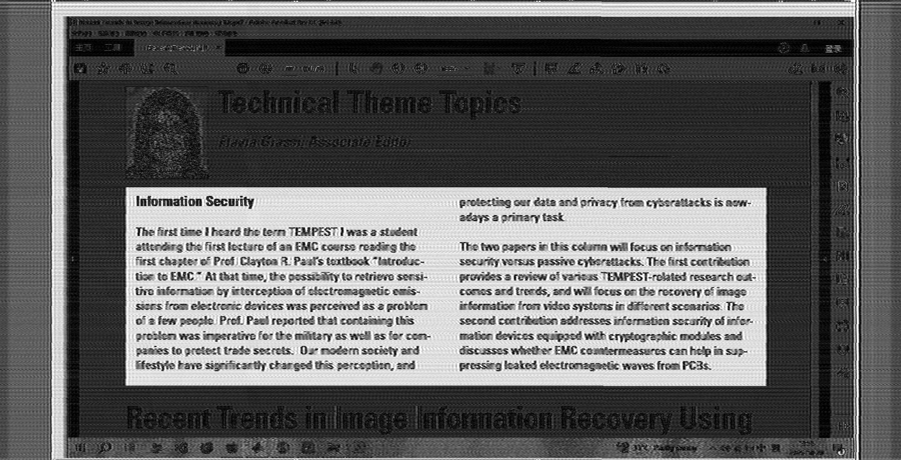

# A-Non-coherent-Amplitude-based-TEMPEST-Image-Reconstruction-Pipeline

This repository provides a **non-coherent** TEMPEST image reconstruction pipeline for HDMI electromagnetic emissions captured by an SDR.  The current implementation focuses on amplitude-based (envelope-like) visualization and rasterization, and serves as a practical baseline for TEMPEST-style text/image recovery. 
> Note: This pipeline is intentionally **non-coherent**. It does not perform pixel-harmonic alignment, iterative pixel-clock refinement, or complex-domain periodic averaging (as in coherent demodulation approaches).  
> If you are looking for a coherent reconstruction pipeline, this repo can be used as a baseline for comparison.

---

## Architecture

The pipeline consists of two main folders:

* **SDR sampling & data conversion scripts:**
  *  Carries out data sampling, of which hardware presently uses an ANTSDR-E316 (AD9361, PlutoSDR firmware).
    
* **TEMPEST reconstruction pipeline:**
  Which contains three jupyter notebooks:
  *  Base reconstruction (resampling + rasterization + amplitude visualizations)
  *  Geometric correction (**shear / shift**)
  *  Image quality metrics evaluation (**SSIM / PSNR**) — *experimental / still under testing*

## Reconstruction demo
The demo image was reconstructed from signals sampled at SDR configuration as such:
~~~
ip        = 'ip:192.168.10.1';   % PlutoSDR ip
Fs        = 60e6;                % sample rate
Fc        = 742.5e6;             % fc
Tsec      = 0.5;                 % recording time        
gain_dB   = 35;                  % gain
~~~
According to power spectrum shown on AirSpy SDR#, the signals were far from saturated at 35 dB.

### Reference image
The whole desktop which was displayed on a monitor (1020*1080, 60Hz).

---

### Reconstrcuted image, cut
The image reconstructed from sampled EM signal, which was cut to 1920*1080.

---

### Reconstrcuted image, original
The original image reconstructed from sampled EM signal, with addition pixels (2200*1125 in total) introduced by HDMI protocol.

---
